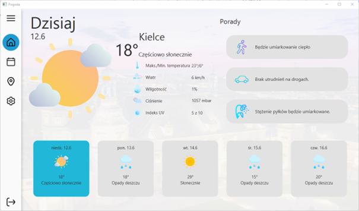
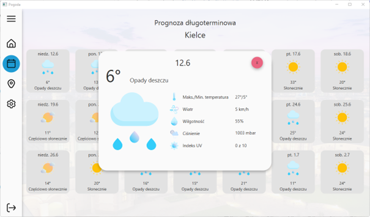
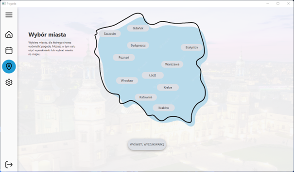

# Weather App
Weather app created in Java. App developed in 2022.

## Technologies Used
### Languages
- Java
### Libraries
- javaFx 17.0.1 – GUI
- jfoenix 9.0.10 – GUI addons

## Example Screenshots
### Forecast

### Long-term Forecast

### Selecting City

## Contribution
### Assets
- Icons made by fjstudio, freepik, Ajmal Naha, Kushal Jain, CreativeCons, Catalin Fertu, Pixel perfect, Dhaval Bharadava, surang, Kiranshastry from [flaticon.com](https://www.flaticon.com/)
- Others
